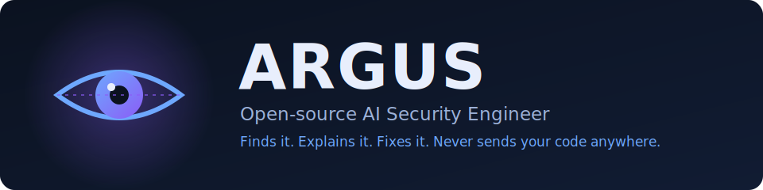

<div align="center">



<h1>Argus</h1>

**Your open-source AI Security Engineer.** Point it at a codebase or a running app.
It maps the system, runs layered security analysis, explains every finding the way
a senior application-security engineer would, and where it can, it writes the fix
and checks that the fix actually works.

[](https://pypi.org/project/argus-appsec/)
[](https://pypi.org/project/argus-appsec/)
[](LICENSE)
[](https://github.com/hasipfaruk/Argus/actions/workflows/ci.yml)
[](.github/workflows/argus-scan.yml)
[](https://genai.owasp.org/llm-top-10/)

[Install](#install) · [Quick start](#quick-start) · [How it works](#how-it-works) · [Docs](docs/) · [Roadmap](#roadmap)

</div>

---

Argus is not just another scanner that prints a list. For each finding it tells you
*why* it is a vulnerability, *how* an attacker would exploit it, the *business
impact*, the likelihood and severity, the CWE and OWASP mapping, and concrete
remediation. Then it can generate a patch and confirm the patch closes the issue.

> **Status: early alpha.** The architecture and full pipeline are in place: a working
> CLI, eight built-in scanners (including a first-class LLM/agent scanner), a
> multi-provider AI layer, cross-file taint analysis, and six report formats. See the
> [roadmap](#roadmap).

## Why Argus

| | What you get |
|---|---|
| :mag: **It understands the project first** | Detects languages and frameworks and builds an architecture map (APIs, auth flows, datastores, third-party services, cloud, containers, CI/CD, dependency manifests) before it scans a single line. |
| :onion: **Layered analysis** | Secrets, dependency CVEs (live [OSV](https://osv.dev) data, transitive packages from lockfiles across PyPI, npm, Go, Rust, Ruby, PHP), SAST, tree-sitter taint analysis, and infrastructure-as-code checks, all in one pass. |
| :robot: **Built for AI-era codebases** | A first-class LLM and agent security scanner mapped to the [OWASP Top 10 for LLM Apps](https://genai.owasp.org/llm-top-10/): insecure model-output handling, prompt injection, secrets in prompts, over-privileged agent tools, and unsafe model loading. |
| :mute: **Low noise on purpose** | Reachability analysis marks a CVE in a package your code never imports as lower priority. Cross-file taint follows untrusted input across function and file boundaries so real bugs surface and false alarms stay quiet. |
| :lock: **Your code stays yours** | Offline heuristic provider by default (no key, no network). Ollama runs models fully locally. Anthropic and OpenAI are opt-in for teams that want cloud models. |
| :hammer_and_wrench: **It fixes, not just finds** | Deterministic, self-verified fixes go to a fresh branch and open a pull request. An AI-proposed tier drafts riskier fixes, verifies them, and labels them for human review. Nothing risky is ever auto-applied. |
| :vertical_traffic_light: **CI-native** | Deterministic output, SARIF and GitLab reports, and diff-aware scanning so pull requests are gated only on findings they introduce. One-block GitHub Action, pre-commit hooks, and a Docker image. |
| :jigsaw: **Plugin-based throughout** | Scanners, reporters, and AI providers are plugins. Add a language, a report format, or even a rule in plain YAML without touching the core. |

## Install

```bash
# From PyPI
pip install argus-appsec

# With cloud model support
pip install "argus-appsec[anthropic,openai]"

# With the AST data-flow tier (deeper Python/JS taint analysis, via tree-sitter)
pip install "argus-appsec[ast]"

# With the optional web dashboard (scan history and risk trends)
pip install "argus-appsec[dashboard]"
```

From source, for development:

```bash
git clone https://github.com/hasipfaruk/Argus
cd Argus
pip install -e ".[dev]"
```

Requires Python 3.10+. The installed command is `argus`.

## Quick start

```bash
# Scan a local project and print a table
argus scan ./my-app

# Turn on the flagship features and write an HTML report
argus scan ./my-app --attack-sim --patches -f html -o report.html

# Scan a remote repository (shallow-cloned to a temp dir, then cleaned up)
argus scan https://github.com/org/repo

# Apply Argus's verified fixes to a branch and open a pull request
argus fix ./my-app --open-pr

# Use a local model so code stays on your machine
argus scan ./my-app --ai-provider ollama --ai-model llama3.1

# Machine-readable output for CI, failing the build on High and above
argus scan ./my-app -f sarif -o results.sarif --fail-on high
```

Explore what is available:

```bash
argus scanners     # list scanners
argus reporters    # list report formats
argus providers    # list AI providers and whether each is usable right now
argus init         # write a starter .argus.yml
```

## CI in one block

The official GitHub Action uploads findings to GitHub Code Scanning and is
diff-aware on pull requests, so merges are gated only on findings a PR
*introduces*, never on pre-existing ones:

```yaml
permissions:
  contents: read
  security-events: write
steps:
  - uses: actions/checkout@v4
    with: { fetch-depth: 0 }
  - uses: hasipfaruk/Argus@v0.7.0
    with:
      fail-on: high
```

You also get [pre-commit hooks](docs/ci-cd.md#pre-commit-hook) that block secrets
before they enter git history, an official Docker image (`ghcr.io/hasipfaruk/argus`),
and GitLab CI and Bitbucket Pipelines snippets. See [docs/ci-cd.md](docs/ci-cd.md).

## How it works

```
 target  -->  resolve   -->  analyze    -->  scan      -->  enrich     -->  report
             path/git/     languages,     secrets,       reasoning,      json, sarif,
             url           frameworks,    deps, sast,     attack sim,     gitlab, md,
                           architecture   iac, llm        patches         html, csv
```

The engine never modifies the target. It returns a `ScanResult`, and its only write
is to Argus's own cache (`--no-cache` disables even that). Scanners run concurrently
and unchanged files reuse cached findings, so warm scans stay fast
([measured numbers](docs/performance.md)) while reports stay deterministic, byte for
byte. Reporting and any pull-request creation are separate, explicit steps. See
[docs/architecture.md](docs/architecture.md).

## Configuration

Drop a `.argus.yml` in your project root (generate one with `argus init`):

```yaml
min_severity: low
fail_on: high
attack_simulation: true
generate_patches: true
ai:
  provider: ollama      # heuristic | anthropic | openai | ollama
  model: llama3.1
scanner_options:
  secrets:
    entropy_threshold: 4.2
```

Full reference: [docs/configuration.md](docs/configuration.md).

## Extending Argus

Everything is a plugin. Here is a whole scanner:

```python
from argus.core.plugin import Scanner, ScannerContext, scanner
from argus.core.models import Finding, Location, Severity

@scanner
class HelloScanner(Scanner):
    name = "hello"
    category = "example"
    description = "Flags TODO comments as a demo."

    def scan(self, ctx: ScannerContext):
        for f in ctx.project.files():
            for i, line in enumerate(f.lines(), 1):
                if "TODO" in line:
                    yield Finding(
                        id=f"hello:todo:{i}", rule_id="hello.todo", scanner=self.name,
                        title="TODO left in code", description="A TODO marker.",
                        location=Location(path=f.rel_path, start_line=i),
                        severity=Severity.INFO,
                    )
```

Register it via the `argus.plugins` entry point in your package and Argus picks it up
automatically. Prefer regex over code? You can add a rule in plain
[YAML](docs/plugins.md#community-rules-yaml-no-python) instead. Full guide:
[docs/plugins.md](docs/plugins.md).

## AI providers and data handling

| Provider    | Location | Source leaves your machine? | Needs |
|-------------|----------|-----------------------------|-------|
| `heuristic` | local    | no                          | nothing (default) |
| `ollama`    | local    | no                          | a running Ollama server |
| `anthropic` | cloud    | yes                         | `ANTHROPIC_API_KEY` + `[anthropic]` extra |
| `openai`    | cloud    | yes                         | `OPENAI_API_KEY` + `[openai]` extra |

If a requested provider is unavailable, Argus warns and falls back to `heuristic` so a
scan always completes.

## Fixing, not just finding

`argus fix` closes the loop. It scans a repository, applies the fixes it can verify
locally to a fresh branch, commits them, and with `--open-pr` opens a pull request.

```bash
argus fix ./my-app --dry-run      # preview the changes, write nothing
argus fix ./my-app                # apply fixes to a branch and commit locally
argus fix ./my-app --open-pr      # also push and open a PR (needs GITHUB_TOKEN)
```

Only deterministic, self-verified fixes are applied by default. Examples: unsafe
`yaml.load` becomes `yaml.safe_load`, weak hashes become SHA-256, `shell=True` is
removed, `debug=True` becomes `debug=False`, and `torch.load` gains
`weights_only=True`. See [docs/fixing.md](docs/fixing.md).

## Roadmap

**Implemented.** Project analysis; secrets, dependency, SAST, and IaC scanners; a
first-class LLM and agent security scanner (OWASP LLM Top 10); live OSV vulnerability
data; multi-provider AI enrichment; Attack Simulation Mode; deterministic patch
generation with self-verification; automated fix branches and pull requests
(`argus fix`); baseline and diff-aware scanning; dependency reachability analysis;
opt-in secret verification; safe runtime posture checks for a live URL; per-file
caching and parallel scanners; and JSON, SARIF, GitLab, Markdown, HTML, and CSV
reporting.

**Deep code analysis.** AST data-flow scanning ships for Python and
JavaScript/TypeScript (`pip install "argus-appsec[ast]"`), tree-sitter taint analysis
that follows untrusted input through multiple hops into a sink and treats
parameterized queries and sanitized values as safe. For Python it also includes a
cross-file, inter-procedural tier that follows taint one hop across a function and
file boundary. Go ships SAST rules today, with more languages next.

**Author rules in YAML.** Add SAST rules with only regex and a few fields, no Python,
via `.argus/rules/*.yml` or `scanner_options.patterns.rules`. See
[docs/plugins.md](docs/plugins.md#community-rules-yaml-no-python).

**Web dashboard.** Scan history and risk trends ship as an optional extra:
`pip install "argus-appsec[dashboard]"` then `argus dashboard`. See
[docs/dashboard.md](docs/dashboard.md).

**Distribution.** An official GitHub Action, pre-commit hooks, and a published Docker
image. See [docs/ci-cd.md](docs/ci-cd.md).

**Planned.** Full dynamic analysis (DAST) building on the posture layer, deeper taint
depth (multi-hop cross-file), more deep-analysis languages, team collaboration on the
dashboard, and richer compliance rule packs.

## Known limitations

Argus is early-stage and honest about what it does not yet do, because a security
scanner you cannot trust is worse than none:

- **Primarily static analysis.** It reads code rather than running your app. The
  `--live-target` posture layer adds safe, read-only runtime checks (headers,
  cookies, TLS, exposed paths), but it is not full DAST. There is no crawling,
  fuzzing, or exploitation.
- **Deepest for Python and JavaScript/TypeScript.** Other languages are detected and
  covered by the secrets, dependency, LLM, and IaC scanners, and Go has SAST rules,
  but code-level coverage for the rest is limited so far.
- **Code scanning has blind spots.** The default regex tier catches common patterns.
  The optional AST tier follows multi-hop and one-hop cross-file data flows and avoids
  common false positives, but deeper multi-hop cross-file flows can still be missed.
  Treat a clean result as "no known issues found," not a proof of safety.
- **Dependency coverage depends on OSV.** Offline, it falls back to a small bundled
  advisory seed (PyPI and npm) and tells you so.

Treat Argus as a strong, fast first line of defense, not a replacement for a manual
security review of critical code.

## Contributing

Contributions are welcome from everyone. The flow is the standard one:

1. **Fork** this repository.
2. Create a branch and make your change, with tests.
3. Open a **pull request**. The template will guide you, and CI runs tests and lint
   automatically.

Scanners, language support, compliance rules, and report formats are especially
welcome, and the plugin model means most additions never touch the core. See
[CONTRIBUTING.md](CONTRIBUTING.md) for setup and standards, and
[CODE_OF_CONDUCT.md](CODE_OF_CONDUCT.md) for community guidelines.

## License

Apache-2.0. See [LICENSE](LICENSE).
