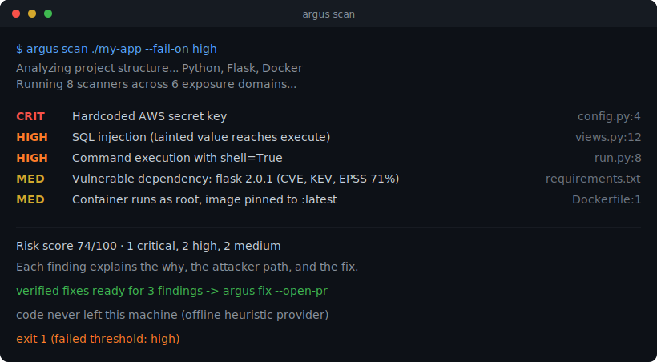

# Argus AppSec

**Your open-source AI security engineer.** Point it at a codebase or a running
app. It maps the system, runs layered security analysis, explains every finding
the way a senior application-security engineer would, and where it can, it writes
the fix and checks that the fix actually works.

[](https://pypi.org/project/argus-appsec/)
[](https://pypi.org/project/argus-appsec/)
[](https://github.com/Argus-CodeSecurity/Argus-appsec/blob/main/LICENSE)
[](https://securityscorecards.dev/viewer/?uri=github.com/Argus-CodeSecurity/Argus-appsec)

{ loading=lazy }

!!! note "Status: early alpha (0.x)"
    The architecture and full pipeline are in place: a working CLI, built-in
    scanners across six exposure domains, a multi-provider AI layer, cross-file
    taint analysis, and eight report formats. Detection accuracy is still being
    benchmarked. Treat findings as a strong signal to review, not gospel.

## What Argus does

- **Understands the project first.** Detects languages and frameworks and builds
  an architecture map (APIs, auth flows, datastores, cloud, containers, CI/CD,
  dependency manifests) before it scans a line.
- **Layered analysis in one pass.** Secrets, dependency CVEs (live
  [OSV](https://osv.dev) data with reachability), SAST, tree-sitter taint
  analysis, IaC misconfiguration, and a first-class LLM/agent scanner mapped to
  the [OWASP Top 10 for LLM Apps](https://genai.owasp.org/llm-top-10/).
- **Explains, not just lists.** Each finding carries the why, the attacker path,
  business impact, likelihood, severity, and a CWE/OWASP mapping.
- **Fixes, not just finds.** Deterministic, self-verified fixes go to a fresh
  branch and open a pull request. Nothing risky is auto-applied or auto-merged.
- **Keeps your code yours.** Offline heuristic provider by default (no key, no
  network). Ollama runs locally. Cloud models are opt-in.

## What Argus does NOT do

Security engineers trust tools that state their limits. Argus is honest about its:

- **No DAST / runtime testing.** Argus is static analysis. It does not run your
  app, fuzz endpoints, or perform authenticated crawling.
- **Taint depth varies by language.** Cross-file data-flow is strongest for
  Python and JavaScript/TypeScript. Other languages get pattern and
  lightweight-taint coverage, not full interprocedural analysis.
- **Not a full enterprise ASPM.** No ticketing, no SSO, no policy-as-code engine.
  It is a scanner and a fixer, not a platform.
- **Dependency coverage follows OSV.** A vulnerability absent from OSV is absent
  from Argus. Reachability lowers noise but is heuristic, not a proof.
- **Not a replacement for a human review or a pen test.** A clean scan means
  "nothing these checks caught," not "secure."

## Quickstart

```bash
pip install argus-appsec

# Scan a local project and print a table
argus scan ./my-app

# Turn on the flagship features and write an HTML report
argus scan ./my-app --attack-sim --patches -f html -o report.html

# Machine-readable output for CI, failing the build on High and above
argus scan ./my-app -f sarif -o results.sarif --fail-on high
```

Explore what is available:

```bash
argus scanners     # list scanners
argus reporters    # list report formats (json, sarif, html, markdown, csv, gitlab, vex, badge)
argus providers    # list AI providers and whether each is usable right now
argus init         # write a starter .argus.yml
```

## Where to next

- [Scanners & coverage](scanners.md), exactly what each domain detects and does not.
- [Triage & baselines](triage.md), keep the tool low-noise on real repos.
- [CI/CD integration](ci-cd.md), the one-block GitHub Action and diff-aware gating.
- [How Argus compares](comparison.md), an honest look versus Semgrep, Trivy, and Snyk.
- [Security & threat model](security.md), because a scanner is also an attack surface.
